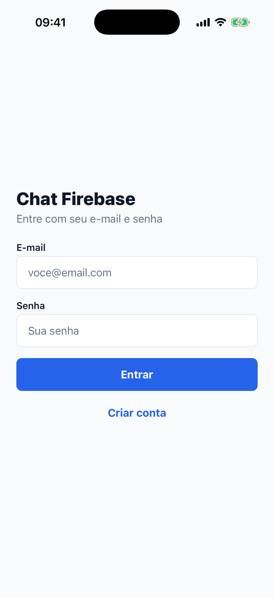
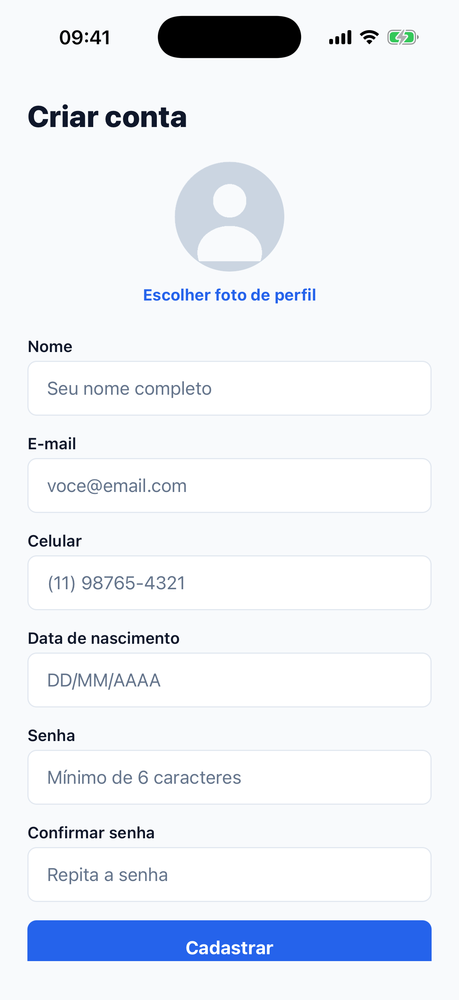
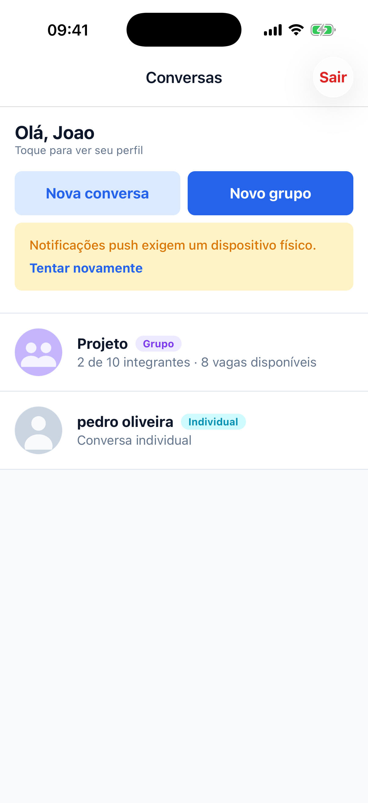
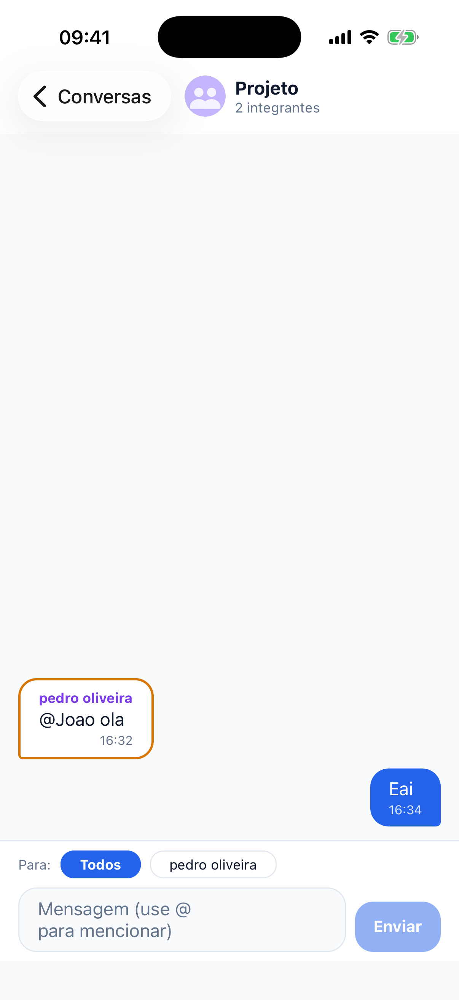
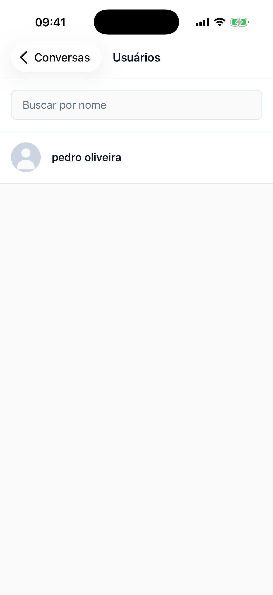
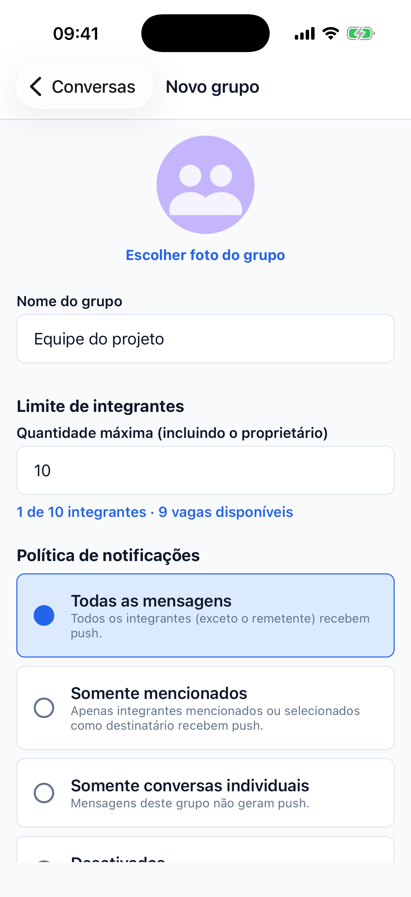
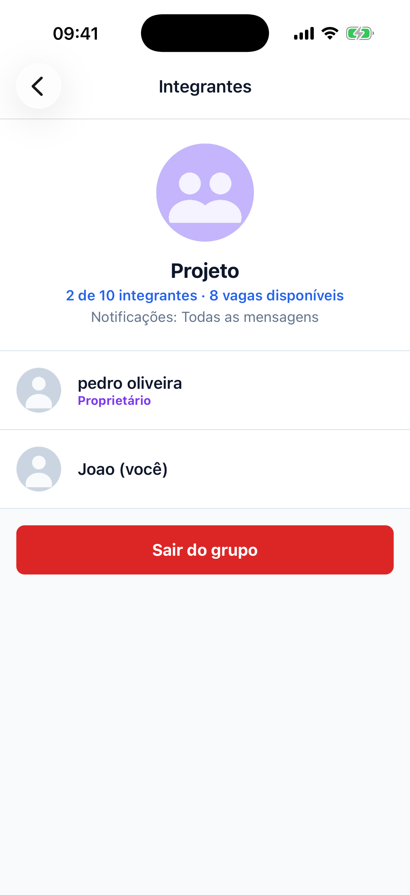
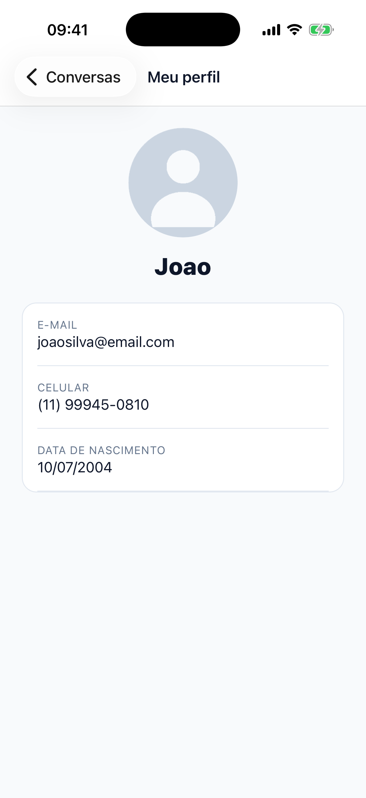
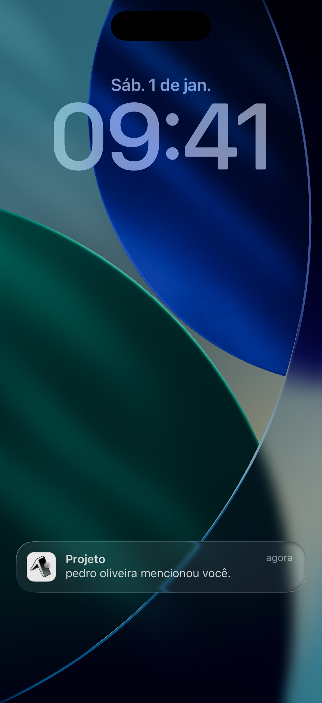

# Chat Firebase Push

Aplicativo de **chat em React Native + TypeScript** com conversas individuais e em grupo, autenticação por **e-mail e senha**, mensagens em **tempo real** e **notificações push** enviadas por uma **API própria publicada na internet**.

Trabalho de React Native — *Chat individual e em grupo com Firebase e Push Notifications* (FIAP).

---

## Integrantes

- RM99943 — Pedro Oliveira
- RM557817 — Diego Cabral
- RM555694 - Debora Ivanowski

---

## Tecnologias

| Camada | Tecnologia |
|---|---|
| App | React Native 0.86, **Expo SDK 57**, TypeScript (strict, sem `any`) |
| Navegação | React Navigation 7 (Native Stack, rotas tipadas) |
| Autenticação | Firebase Authentication (e-mail/senha) com sessão persistida no AsyncStorage |
| Mensagens | Firebase Realtime Database |
| Dados | Cloud Firestore |
| Imagens | Cloudinary (plano gratuito, upload assinado pela API) + `expo-image-picker` |
| Push (app) | `expo-notifications` (token Expo, entregue via **FCM** no Android e APNs no iOS) |
| API | Node.js 22 + Express 5 + TypeScript, Firebase Admin SDK, `expo-server-sdk` |
| Hospedagem da API | Render (HTTPS) |
| Testes | Node test runner, Firebase Emulator Suite, `@firebase/rules-unit-testing` |

---

## Serviços Firebase e responsabilidades

| Serviço | Responsabilidade |
|---|---|
| **Authentication** | Criar conta, login, recuperar sessão (AsyncStorage), identificar pelo `uid`, logout. |
| **Realtime Database** | Armazenar as mensagens (individuais e de grupo), sincronizar em tempo real (`onValue`), espelho `groupMembers` usado pelas regras. |
| **Cloud Firestore** | Perfis (`users`, `publicProfiles`), grupos e metadados (`groups`: integrantes, `memberLimit`, `notificationPolicy`), conversas individuais, tokens de dispositivos (`users/{uid}/devices`), vínculos e controle de idempotência. |
| **Cloud Messaging (FCM)** | Entrega das notificações no Android (credencial FCM V1 configurada no EAS). O Expo Push Service encaminha para o FCM/APNs. |

> Cloud Functions **não** é utilizado. O envio do push é feito pela API própria.
>
> Todo o projeto roda **sem custos e sem cartão de crédito**: Firebase no plano Spark, fotos no Cloudinary (plano gratuito), API no Render (plano gratuito) e builds no EAS (plano gratuito).

### Estrutura de dados

**Cloud Firestore**

```text
users/{uid}                       name, email, phoneNumber, birthDate, photoUrl, createdAt   (privado)
users/{uid}/devices/{deviceId}    token, platform, enabled, updatedAt                         (só o dono)
publicProfiles/{uid}              uid, name, photoUrl                                         (lista de usuários)
groups/{groupId}                  name, photoUrl, ownerId, memberIds, memberLimit,
                                  notificationPolicy, createdAt, updatedAt
directConversations/{uidA_uidB}   participantIds, createdAt                                   (uids ordenados)
userLinks/{viewer_target}         groupIds                                                    (somente API)
notificationDispatches/{cid_mid}  status, recipients, ...                                     (somente API)
```

**Realtime Database**

```text
messages/{conversationId}/{messageId}
  conversationType, senderId, text, target, mentionedUserIds, createdAt
groupMembers/{groupId}/{uid}: true        (espelho de integrantes ativos, escrito somente pela API)
```

---

## Estrutura do projeto

```text
chat-firebase-push/
├── App.tsx                     # Providers (SafeArea, Auth) + rotas
├── app.config.ts               # Configuração Expo (plugins de notificações e image picker)
├── firebaseConfig.json         # Configuração do SDK cliente (sem credenciais administrativas)
├── firestore.rules             # Regras do Firestore (versionadas)
├── database.rules.json         # Regras do Realtime Database (versionadas)
├── firebase.json / .firebaserc # Deploy das regras e emuladores
├── render.yaml                 # Blueprint de deploy da API no Render
├── src/
│   ├── config/                 # firebase.ts (Auth, Firestore, RTDB), api.ts (URL da API)
│   ├── navigation/             # index.tsx (stack), types.ts (RootStackParamList)
│   ├── contexts/               # AuthContext, NotificationContext
│   ├── hooks/                  # useAuth, useChat, useConversations, useGroups, useUsers,
│   │                           # useNotifications, useSubscription, useProfiles, useImagePicker
│   ├── services/               # api, authService, userService, storageService,
│   │                           # chatService, groupService, notificationService
│   ├── components/             # Avatar, Button, Input, Loading, ErrorMessage, EmptyState,
│   │                           # ChatMessage, ChatInput, ConversationItem, UserItem,
│   │                           # GroupMemberItem, PolicySelector, InfoRow, ImagePickerField
│   ├── screens/                # Login, Register, Conversations, Users, GroupForm,
│   │                           # GroupMembers, Chat, Profile
│   ├── types/                  # user, chat, group, notification, firebase
│   ├── theme/                  # design tokens
│   └── utils/                  # conversationId, groupValidation, mentions, parsers,
│                               # errorMessages, formatters
├── server/                     # API de notificações e grupos
│   └── src/
│       ├── app.ts / server.ts
│       ├── middleware/         # authenticate.ts (Firebase ID Token), errorHandler.ts
│       ├── routes/             # health.ts, notifications.ts, groups.ts, uploads.ts
│       └── services/           # firebaseAdmin, recipientResolver, notificationSender, messageNotifier,
│                               # dispatchRegistry, groupMembership, groupRules, imageUpload
└── tests/rules/                # Testes das regras + integração da API no Firebase Emulator
```

Arquitetura em camadas (mesmo padrão do material da disciplina):

```text
Screen → Hook → Service → Firebase SDK / API
```

---

## Instalação e execução do app

Pré-requisitos: Node.js 20+, conta Expo (EAS) e um projeto Firebase configurado (ver abaixo).

```bash
npm install
npx expo start
```

As notificações push **não funcionam no Expo Go** (SDK 53+). Para testar o push é necessário um build nativo em dispositivo físico:

```bash
npx eas-cli@latest login
npx eas-cli@latest init                       # copie o projectId para app.config.ts (EAS_PROJECT_ID)
npx eas-cli@latest build --profile preview --platform android   # gera um APK instalável
```

Scripts úteis:

```bash
npm run typecheck   # TypeScript
npm run lint        # ESLint (proíbe any)
npm run test:api    # testes unitários da API
npm run test:rules  # regras + integração no Firebase Emulator (requer Java)
```

---

## Configuração do Firebase

Projeto utilizado: **`cp2-mobile-bb2a8`** (plano Spark, sem custos).

1. Crie um projeto no [Firebase Console](https://console.firebase.google.com/) (o plano gratuito **Spark** é suficiente).
2. **Authentication → Sign-in method →** habilite apenas **E-mail/senha**.
3. Crie o **Cloud Firestore** e o **Realtime Database**.
4. **Configurações do projeto → Seus apps →** registre um app **Web (`</>`)** e copie os valores para `firebaseConfig.json` (inclua `databaseURL`).
5. Registre também um app **Android** com o pacote `br.com.fiap.chatfirebasepush` e salve o `google-services.json` na raiz do projeto.
6. Publique as regras versionadas:

```bash
npx firebase-tools login
npx firebase-tools use <seu-project-id>
npx firebase-tools deploy --only firestore:rules,database
```


---

## Armazenamento das fotos

Serviço escolhido: **[Cloudinary](https://cloudinary.com/)** (plano gratuito, sem cartão), cloud name `grp8nkfh`. O Firebase Storage exige o plano pago Blaze em projetos novos, então não foi usado.

Fluxo (upload **assinado** — o segredo nunca fica no app):

```text
App escolhe a foto (expo-image-picker, permissão tratada em useImagePicker)
   ↓
POST /uploads/signature  (Bearer Firebase ID Token)  { target: "avatar" } | { target: "group", groupId }
   ↓
API valida o usuário (e se é dono do grupo) e assina pasta + nome do arquivo com o segredo do Cloudinary
   ↓
App envia a imagem direto ao Cloudinary com a assinatura
   ↓
Somente a URL final (https://res.cloudinary.com/...) é salva no Firestore (photoUrl)
```

- Nenhuma imagem é salva em Base64 nos bancos; as regras do Firestore só aceitam `photoUrl` vazio ou do Cloudinary.
- Um usuário só consegue gravar `chat-firebase-push/avatars/{seu uid}` ou a foto de grupos dos quais é proprietário.
- Se a URL estiver vazia ou falhar ao carregar, o componente `Avatar` exibe uma imagem padrão (`assets/default-avatar.png` / `default-group.png`).

### Configuração do Cloudinary

1. Crie uma conta gratuita em [cloudinary.com](https://cloudinary.com/users/register_free).
2. No **Dashboard → API Keys**, copie *Cloud name*, *API Key* e *API Secret*.
3. Configure-os **somente** nas variáveis do Render: `CLOUDINARY_CLOUD_NAME`, `CLOUDINARY_API_KEY`, `CLOUDINARY_API_SECRET`.

---

## Configuração das notificações

O app usa **Expo Notifications**. O token do aparelho (`ExponentPushToken[...]`) é salvo em `users/{uid}/devices/{deviceId}`; a API envia pelo **Expo Push Service**, que entrega pelo **FCM** (Android) e **APNs** (iOS).

### Android

1. No Firebase Console: **Configurações do projeto → Contas de serviço → Gerar nova chave privada** (conta dedicada ao FCM).
2. Envie essa chave ao EAS: `npx eas-cli@latest credentials` → Android → *Google Service Account* → *FCM V1*. ([guia oficial](https://docs.expo.dev/push-notifications/fcm-credentials/))
3. Garanta que `google-services.json` está na raiz e gere o build (`eas build --profile preview --platform android`).
4. Canal de notificação: `messages` (criado pelo app e usado pela API).

### iOS

O aplicativo executa no iOS pelo **Expo Go** (`npx expo start` → escanear o QR Code), com cadastro, conversas, grupos e mensagens em tempo real.

Notificações push no iOS exigem uma conta **Apple Developer** (paga) para gerar a chave APNs e um build nativo. Como o projeto foi mantido **sem custos**, o push foi validado no **Android**. Com uma conta Apple, basta executar `eas build --platform ios` e permitir que o EAS gere a chave de push — nenhum código precisa mudar.

### Fluxo

```text
Usuário envia a mensagem
        ↓
Realtime Database persiste a mensagem
        ↓
Listeners atualizam a conversa aberta
        ↓
App chama POST /notifications/messages { conversationId, messageId }  (Bearer ID Token)
        ↓
API valida token, mensagem (RTDB), remetente, participantes e política (Firestore)
        ↓
API calcula os destinatários e envia (Expo Push → FCM/APNs)
        ↓
Toque na notificação → app abre a conversa (payload: conversationId, conversationType)
```

O texto do push não inclui o conteúdo da mensagem (ex.: “Maria enviou uma mensagem”), evitando expor informações sensíveis.

---

## Política de notificações

Cada grupo possui `notificationPolicy`, configurável pelo proprietário na tela do grupo:

| Política | Quem recebe push |
|---|---|
| `all_group_messages` | Todos os integrantes, exceto o remetente. |
| `mentioned_members` | Somente integrantes mencionados com `@Nome` ou escolhidos no seletor “Para:” (mensagem direcionada). |
| `direct_messages_only` | Ninguém: mensagens do grupo não geram push (apenas conversas individuais geram). |
| `disabled` | Ninguém: o grupo não gera push. |

Conversas individuais sempre notificam o outro participante. Em todos os casos o remetente é excluído e apenas integrantes ativos podem receber. A regra está em [`server/src/services/recipientResolver.ts`](server/src/services/recipientResolver.ts) e coberta por testes.

Mensagens direcionadas continuam no histórico do grupo (visíveis a todos); a política define apenas quem recebe o push.

Tokens inválidos (`DeviceNotRegistered` nos tickets ou recibos do Expo, ou formato inválido) são **desativados** (`enabled: false`). No logout o token do aparelho também é desativado.

---

## Limite de integrantes e concorrência

- `memberLimit` é definido na criação (inteiro entre 2 e 50, incluindo o proprietário), pode ser alterado pelo proprietário e não pode ficar abaixo da quantidade atual de integrantes.
- A interface mostra “X de Y integrantes · Z vagas disponíveis” e bloqueia a seleção quando não há vagas.
- **Proteção real:** toda alteração de `memberIds`/`memberLimit` passa pela API, que usa uma **transação do Firestore** (`runTransaction`): lê o grupo, valida a capacidade com o estado mais recente e grava. Se duas requisições concorrerem, a transação é refeita com os dados atualizados e a segunda falha com `GROUP_FULL`.
- As **regras do Firestore** proíbem o app de alterar `memberIds` e `memberLimit` diretamente, então não existe caminho que contorne a transação.
- Como os integrantes ficam no Firestore e as mensagens no RTDB, validações que dependem dos dois serviços são feitas pela API: após cada transação ela atualiza `groupMembers/{groupId}` no RTDB, usado pelas regras para permitir leitura/escrita de mensagens somente por integrantes ativos. Um integrante removido perde o acesso imediatamente.

Teste automatizado (`tests/rules/api.integration.test.ts`): 5 requisições simultâneas disputando 1 vaga → exatamente 1 sucesso e 4 `GROUP_FULL`.

---

## Regras de segurança

Arquivos versionados: [`firestore.rules`](firestore.rules) e [`database.rules.json`](database.rules.json). As fotos ficam no Cloudinary, protegidas pela assinatura da API.

| Garantia | Onde |
|---|---|
| Somente autenticados acessam dados | Firestore, RTDB, API |
| Somente participantes leem/enviam mensagens | RTDB (`uidA_uidB` contém o `uid` ou `groupMembers`) |
| `senderId` = usuário autenticado | RTDB `.validate` |
| Mensagens não podem ser editadas/sobrescritas | RTDB (`!data.exists()`) |
| Somente o proprietário gerencia o grupo | Firestore (nome/foto/política) + API (integrantes/limite) |
| Limite de integrantes respeitado | API (transação) + Firestore (cliente não altera `memberIds`/`memberLimit`) |
| Tokens de dispositivos privados | Firestore `users/{uid}/devices` (somente o dono) |
| Dados cadastrais só com conversa/grupo em comum | Firestore `users/{uid}` (`directConversations` ou `userLinks`) |
| Usuário removido não acessa novas mensagens | RTDB (`groupMembers`) |
| Push só pela API, com destinatários calculados no servidor | API (Firebase Admin SDK) |

As regras são testadas no Firebase Emulator (`npm run test:rules`): 19 cenários de regras + 6 de integração da API.

---

## API online

- **Tecnologia:** Node.js 22 + Express 5 + TypeScript + Firebase Admin SDK + expo-server-sdk
- **Hospedagem:** Render
- **URL pública:** `https://chat-firebase-push-api.onrender.com`
- **Health check:** `GET https://chat-firebase-push-api.onrender.com/health`

```bash
curl https://chat-firebase-push-api.onrender.com/health
# {"status":"ok","service":"chat-firebase-push-api",...}
```

### Endpoints

Todos (exceto `/` e `/health`) exigem `Authorization: Bearer <Firebase ID Token>`.

| Método | Rota | Descrição |
|---|---|---|
| GET | `/health` | Disponibilidade da API |
| POST | `/notifications/messages` | `{ conversationId, messageId }` — valida e envia o push da mensagem. Idempotente: repetir a chamada retorna `{"status":"duplicate"}` sem novo push. |
| POST | `/groups` | Cria grupo `{ groupId, name, photoUrl, memberIds, memberLimit, notificationPolicy }` |
| PATCH | `/groups/:groupId/limit` | Altera `memberLimit` (somente proprietário) |
| POST | `/groups/:groupId/members` | Adiciona integrantes `{ memberIds }` (transação com limite) |
| DELETE | `/groups/:groupId/members/:memberId` | Remove integrante (proprietário) ou sair do grupo (o próprio integrante) |
| POST | `/uploads/signature` | `{ target: "avatar" }` ou `{ target: "group", groupId }` — assinatura para enviar a foto ao Cloudinary |

Erros retornam `{ code, message }` (ex.: `GROUP_FULL`, `NOT_GROUP_OWNER`, `NOT_SENDER`, `INVALID_TOKEN`).

**Idempotência:** cada `conversationId/messageId` cria o documento `notificationDispatches/{conversationId}_{messageId}` com `create()`, que falha de forma atômica se já existir.

### Executar localmente

```bash
cd server
npm install
cp .env.example .env      # preencha com a conta de serviço (NUNCA versionar)
npm run dev
```

### Publicar no Render

1. Envie o repositório ao GitHub.
2. No Render: **New → Blueprint** e selecione o repositório (usa `render.yaml`, raiz `server/`).
3. Configure as variáveis secretas no painel do Render:

| Variável | Descrição |
|---|---|
| `FIREBASE_PROJECT_ID` | ID do projeto Firebase |
| `FIREBASE_CLIENT_EMAIL` | E-mail da conta de serviço |
| `FIREBASE_PRIVATE_KEY` | Chave privada da conta de serviço (com `\n`) |
| `FIREBASE_DATABASE_URL` | URL do Realtime Database |
| `EXPO_ACCESS_TOKEN` | Opcional (se o *Enhanced Security* do Expo Push estiver ativo) |
| `CLOUDINARY_CLOUD_NAME` | Cloud name do Cloudinary |
| `CLOUDINARY_API_KEY` | API Key do Cloudinary |
| `CLOUDINARY_API_SECRET` | API Secret do Cloudinary |

4. Após o deploy, confira `GET /health` e atualize a URL em `src/config/api.ts` (ou `EXPO_PUBLIC_API_URL`).

> **Credenciais:** a chave da conta de serviço fica **somente** nas variáveis secretas do Render. `firebaseConfig.json` contém apenas a configuração do SDK cliente. Use uma conta de serviço dedicada com papéis mínimos (ex.: *Cloud Datastore User*, *Firebase Realtime Database Admin* e *Firebase Authentication Viewer*).

> O plano gratuito do Render hiberna após inatividade; a primeira requisição pode levar alguns segundos. O app usa timeout de 60 s para cobrir esse caso.

---

## Estados e tratamento de erros

O app trata: loading (sessão, perfil, conversas, usuários, mensagens), usuário não autenticado, nenhuma conversa, nenhum usuário, grupo sem vagas, conversa sem mensagens, falha no envio (com **Reenviar/Descartar**), permissão de notificação negada, dispositivo sem token, falha de conectividade, sessão expirada e ações sem permissão. As mensagens de erro são traduzidas em [`src/utils/errorMessages.ts`](src/utils/errorMessages.ts) sem expor detalhes internos.

---

## Prints das telas

> Capturadas no iOS Simulator (iPhone 17 Pro) com o app rodando no Expo Go.

| Login | Cadastro | Conversas | Chat em grupo |
|---|---|---|---|
|  |  |  |  |

| Usuários | Grupo | Integrantes | Perfil |
|---|---|---|---|
|  |  |  |  |

### Notificação (simulada no iOS Simulator)

O iOS Simulator não recebe push remoto, pois não obtém token do APNs; no iOS, o push real exige dispositivo físico (ver [Configuração das notificações](#configuração-das-notificações)). A notificação abaixo foi injetada com `xcrun simctl push`, usando o mesmo título e texto que a API envia quando um integrante é mencionado em um grupo. Ela **não** passou pela API nem pelo Expo Push.



---

## Checklist

- [x] React Native, Expo SDK 57 e TypeScript
- [x] Cadastro e login apenas com e-mail/senha (nome, celular, data de nascimento e foto)
- [x] Logout e recuperação de sessão
- [x] Conversas individuais com exatamente dois participantes (ID determinístico, sem duplicidade)
- [x] Perfil acessível pela foto do participante / pela lista de integrantes
- [x] Criação e edição de grupos, foto do grupo e lista de integrantes
- [x] Limite configurável com proteção contra concorrência (transação + regras)
- [x] Mensagens no Realtime Database com atualização em tempo real
- [x] Perfis, grupos, políticas e tokens no Firestore
- [x] Imagens no Cloudinary com upload assinado pela API (somente URL no Firestore)
- [x] Push enviado pela API online (sem Cloud Functions), autenticada com Firebase ID Token
- [x] Políticas `all_group_messages`, `mentioned_members`, `direct_messages_only`, `disabled`
- [x] Remetente excluído; toque na notificação abre a conversa
- [x] Regras de segurança do Firestore e do RTDB versionadas e testadas
- [x] Hooks (`useState`, `useEffect`, `useMemo`, `useCallback`) e hooks personalizados
- [x] Projeto sem `any` (ESLint)
- [x] `firebaseConfig.json` e `.env.example` (app e API) sem segredos
- [x] Prints das telas, URL final da API e integrantes
- [ ] Print de push recebido em dispositivo físico (incluída apenas notificação simulada no iOS Simulator)
